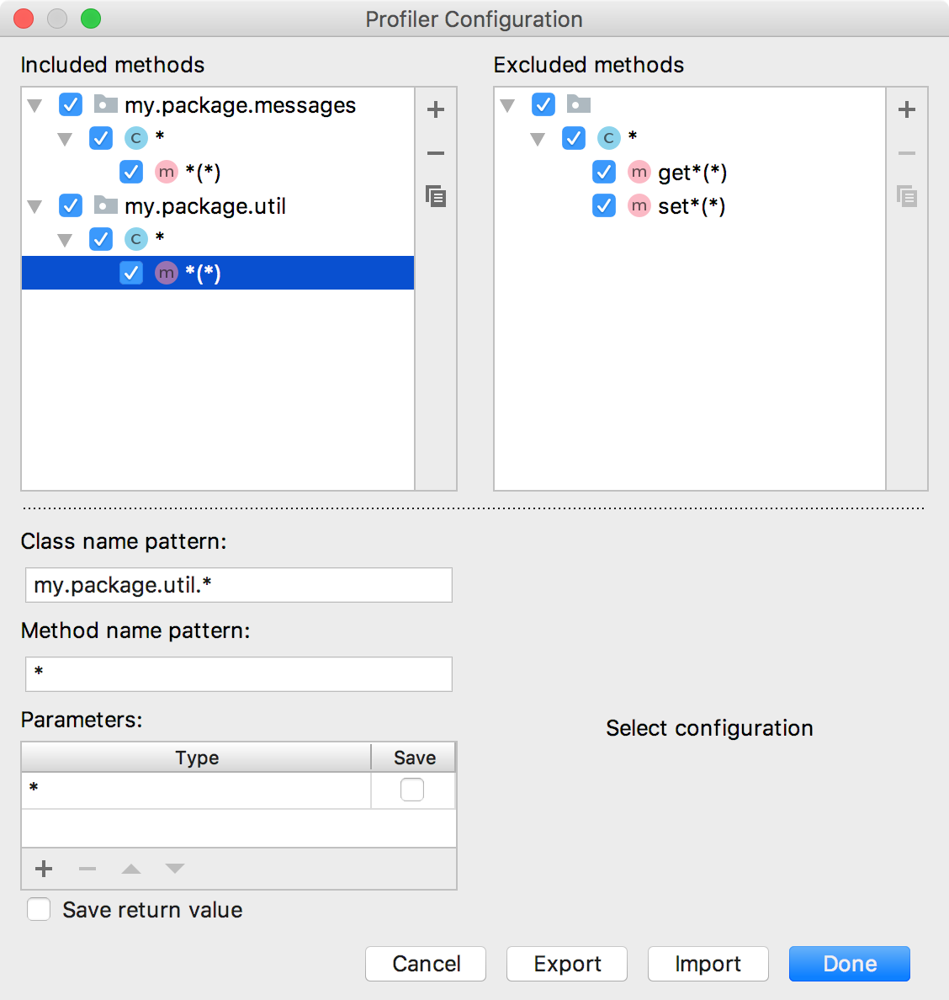
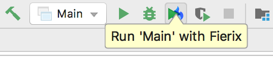

# Fierix
Instrumentation Java profiler

Fierix is an instrumentation Java profiler that can track only specified methods and save values of parameters.

## Quick start
1. To specify methods that will be recorded open **Tools | Edit Fierix Configuration...**
  The configuration below tells profiler to record all methods from my.package.util and my.package.messages packages except methods that start with 'get' or 'set'.  
  

2. To run program with profiler select a run configuration and choose Run with profiler  
  

3. Also you can configure profiler to save value of method's parameters or it's return value.
  This should be done if you want to see how parameters influence method's performance.
  To enable this option check 'Save' checkbox beside type of parameter(s) when editing pattern in configuration.

4. Methods of system classes are not recorded by default.
  You may include them if you specify full name of a system class in configuration. For example: java.io.FileOutputStream.*(*)

5. To view results use [FlameViewer](https://github.com/kornilova-l/FlameViewer)

When your program finishes you will see following message:
```
Methods count: 42
```
If Method count: 0 it means that either configuration is incorrect or all methods took less than 1ms.

## Building from sources

Import project in IntelliJ IDEA and execute gradle tasks `copyAgent` and `runIdea`

